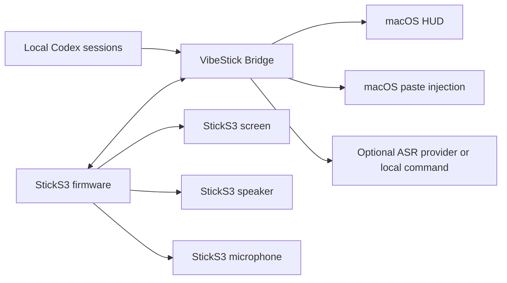

# VibeStick Architecture

VibeStick has two active runtime parts:

1. StickS3 firmware.
2. Local Mac bridge service.

The StickS3 does not call cloud AI services directly. It polls and posts to the Mac bridge over HTTP on the local network.

Battery testing adds two optional, dedicated firmware images. They share the
bridge with VibeStick but do not run the normal agent UI or audio workflow.



## StickS3 Firmware

Firmware lives in `firmware/sticks3/`.

It owns:

- Screen rendering with LVGL.
- Wi-Fi connection.
- Polling `GET /state`.
- Posting button events to `/event` and `/quota/refresh`.
- Blue front-button push-to-talk recording.
- 16 kHz / 16-bit / mono PCM recording from the StickS3 microphone.
- Uploading PCM to `/recording/audio`.
- Agent status sounds generated as PCM and played through ES8311/I2S speaker output.
- Local battery and USB power display from the StickS3 PMIC.

It does not read account cookies, browser state, API keys, or quota dashboards.

## Mac Bridge

Bridge code lives in `bridge/src/vibe_stick/`.

It owns:

- HTTP API for the StickS3.
- Local Codex status and quota observation from `~/.codex/sessions/**/*.jsonl`.
- Recording session state.
- Optional ASR via local command or Groq API.
- Transcript paste injection into the active macOS app.
- HUD state file updates for recording status.

Bridge state is stored under:

```text
~/Library/Application Support/VibeStick/
```

## Transport

v0.1.1 uses HTTP over Wi-Fi.

BLE is not part of the current mainline transport. USB is used for flashing and serial logs, not for runtime state transport.

Battery-test firmware also uses HTTP over Wi-Fi. USB must be removed during a
discharge session; the bridge continues receiving samples wirelessly.

## Battery Telemetry Flow

1. A dedicated test image samples its board PMIC every five seconds.
2. The device posts voltage and external-power state to
   `POST /telemetry/v1/samples`.
3. The bridge keeps the latest device state in memory.
4. When a test session is active, matching samples are appended to that
   session's JSONL file.
5. The read-only dashboard polls bridge APIs and plots sessions by elapsed
   time.
6. The authenticated CLI owns session start and stop transitions.

## State Flow

1. The StickS3 polls `GET /state` every 2 seconds.
2. The Bridge builds a local `VibeStickState`.
3. The StickS3 parses Codex status, quota fields, and alert fields.
4. The StickS3 renders the home screen.
5. Alert sounds are triggered only on relevant alert state changes, not on every poll.

## Recording Flow

1. User long-presses the blue front button.
2. Firmware starts StickS3 microphone recording and posts `/recording/start`.
3. Firmware shows a full-screen listening overlay.
4. User releases the button.
5. Firmware stops recording, uploads PCM to `/recording/audio`, then posts `/recording/stop`.
6. Bridge writes a local WAV file, runs ASR, and pastes the transcript when successful.
7. Recording start and stop do not play agent alert sounds.

## Status And Quota

Codex status is inferred from local Codex process/session activity and recent session event payloads. Quota is inferred from `token_count` events containing `rate_limits`. This is a local observation strategy, not an official quota API.

The StickS3 provider surface is limited to the providers explicitly compiled into the firmware.

## v0.1.1 Limits

- No packaged Mac App.
- No signed firmware release artifact.
- No general device abstraction beyond StickS3.
- No official provider API for quota.
- No BLE runtime transport.
