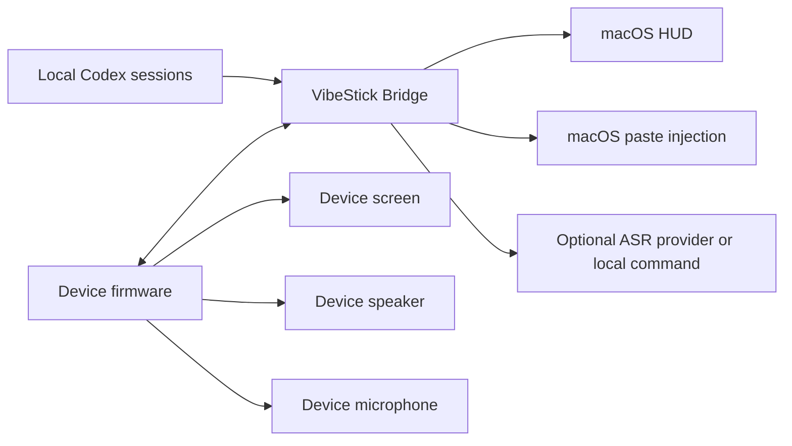

# VibeStick Architecture

VibeStick has two active runtime parts:

1. Device firmware.
2. Local Mac bridge service.

The device does not call cloud AI services directly. It polls and posts to the Mac bridge over HTTP on the local network.



## Device Firmware

Firmware lives in `firmware/sticks3/`.

It owns:

- Screen rendering with LVGL.
- Wi-Fi connection.
- Polling `GET /state`.
- Posting quota refresh events to `/quota/refresh`.
- Front-button tap-to-talk and push-to-talk recording.
- 16 kHz / 16-bit / mono PCM recording from the device microphone.
- Uploading PCM to `/recording/audio`; low-memory targets use append-style chunk uploads.
- Agent status sounds through the board speaker path.
- Local battery and USB power display from the board PMIC.

It does not read account cookies, browser state, API keys, or quota dashboards.

## Mac Bridge

Bridge code lives in `bridge/src/vibe_stick/`.

It owns:

- HTTP API for the StickS3.
- Local Codex status and quota observation from `~/.codex/sessions/**/*.jsonl`.
- Recording session state.
- Optional ASR via local command or Groq API.
- Transcript paste injection into the active macOS app.
- HUD state file updates for recording status.

Bridge state is stored under:

```text
~/Library/Application Support/VibeStick/
```

## Transport

v0.1.1 uses HTTP over Wi-Fi.

BLE is not part of the current mainline transport. USB is used for flashing and serial logs, not for runtime state transport.

## State Flow

1. The StickS3 polls `GET /state` every 2 seconds.
2. The Bridge builds a local `VibeStickState`.
3. The StickS3 parses Codex status, quota fields, and alert fields.
4. The StickS3 renders the home screen.
5. Alert sounds are triggered only on relevant alert state changes, not on every poll.

## Recording Flow

1. User taps the blue front button, or long-presses it for push-to-talk.
2. Firmware starts StickS3 microphone recording and posts `/recording/start`.
3. Firmware shows a full-screen listening overlay.
4. Firmware continuously uploads PCM chunks to `/recording/audio`.
5. User taps the front button again, or releases the long press.
6. Firmware stops recording, drains pending PCM chunks, then posts `/recording/stop`.
7. Bridge writes a local WAV file, runs ASR, and pastes the transcript when successful.
8. Recording start and stop do not play agent alert sounds.

## Status And Quota

Codex status is inferred from local Codex process/session activity and recent session event payloads. Quota is inferred from `token_count` events containing `rate_limits`. This is a local observation strategy, not an official quota API.

The StickS3 provider surface is limited to the providers explicitly compiled into the firmware.

## v0.1.1 Limits

- No packaged Mac App.
- No signed firmware release artifact.
- No general device abstraction beyond StickS3.
- No official provider API for quota.
- No BLE runtime transport.
